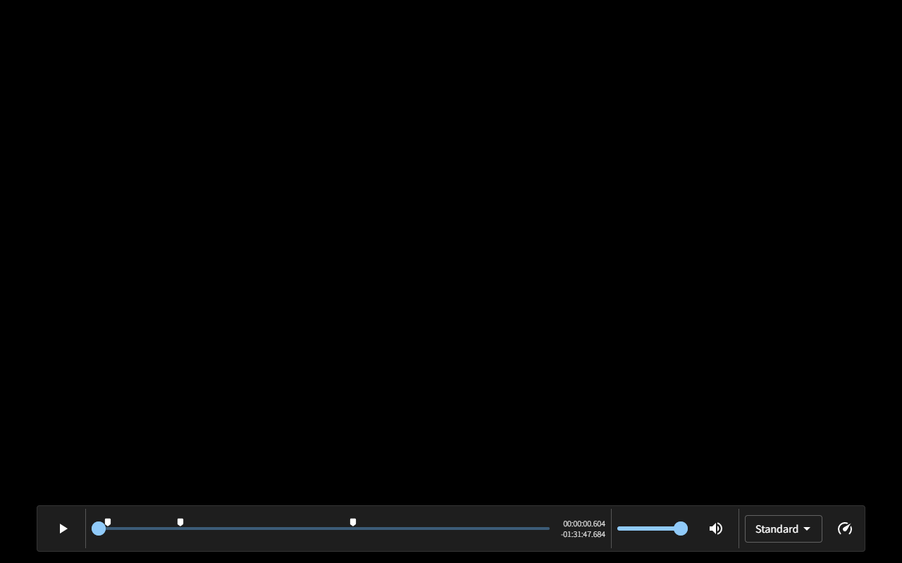

# LMUCast+



Recently I was talking with a friend of mine who studies at the [LMU](https://www.lmu.de/de/index.html) about how nice lecture videos are.\
 And we found out that the LMU player does not support faster playback speeds (Something I think is quite nice to have, If you re-watch a lecture).\
So after some googling, we found out that there should be a way, as [this](https://videoonline.edu.lmu.de/de/faq/kann-ich-ein-video-schneller-oder-langsamer-abspie) help page suggests - but It doesn't work?\
Maybe because it's not intended, as this [document](https://docplayer.org/186774495-Virtuelle-lehre-eine-kleine-handreichung-fuer-lehrende-im-sommersemester-2020.html) indicates ;)\
Anyways, since I think it should be supported and I had some time on my hands, so why not build a chrome-plugin, that does just that!
But since I'm not a student of the LMU and thus don't have access to the videos - I hit a roadblock...\
Nothing, some googling can't fix!\
There's an (I guess openly accessible) law-lecture available [here](https://cast.itunes.uni-muenchen.de/vod/playlists/o3Ao7eBw0f.html), found via google.\
And so I was off to get started!
## How it works
Once installed, the extension is automatically loaded, when you open an LMUCast stream and injects some css and js into the page.\
The changes are only cosmetic and fully client-side, so no, the extension does not interact with the LMU's servers or anything like that.\

## How to install

### Via the ChromeWebStore
I published this extension to the Chrome Webstore as well and since it's passed inspection, you can download it [here](https://chrome.google.com/webstore/detail/lmucast%20/fbkgejlglbgmlkhjocopjhialdaambkc)!

### From Source
You'll either need to have git installed, or be able to download this repo as a zip file :)
#### Getting the package
##### Via Git
Recommended way, simpler to update.

```
git clone https://github.com/meinlebenswerk/LMUCast-.git
```
##### Via Download
Click the code icon in the right corner and then select download zip.
Unpack the zip somewhere and you're ready to install.

##### Installing the extension
- Open Chrome
- Go to settings and then `extensions`
- Enable Developer mode in the right corner
- click on `load unpacked extension` and select the folder where you downloaded/unpacked the extension to
- the extension should show up and be ready to use